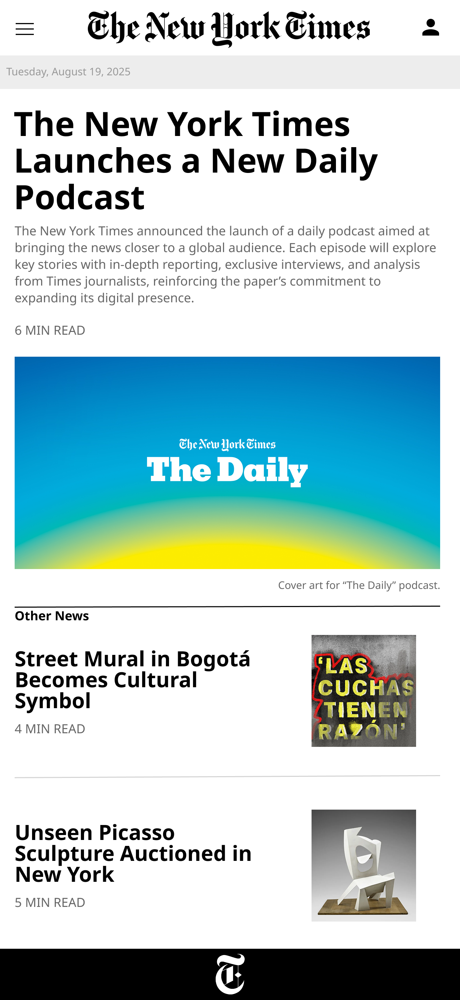

# Landing page The New York Times
Presentar el nuevo servicio de podcast (The Daily) como el producto principal de la página, reforzando su relación con la marca y su rol como fuente confiable de periodismo. Al mismo tiempo, mantener visible la esencia de periódico con otras noticias relevantes.

## Colores de la marca

La elección de los siguientes colores transmiten seriedad, neutralidad y autoridad. Estos colores reflejan los valores fundmentales del periodismo tradicional y de la marca en general.

- #000000 -- negro
- #FFFFFF -- blanco
- #E6E6E6 --gris

## Tipografía

- Noto Sans Georgian 

## Propósito (metodologia de historia de usuario)

¿Quién?: Personas interesadas en informarse sobre la actualidad mundial y comprender temas complejos de manera clara y accesible, valorando información confiable y de calidad.

¿Qué necesita?: Estar al día con las noticias, entender contextos complejos y acceder a información confiable en un formato ágil que se adapte a su rutina diaria, como escuchar mientras se transportan, caminan o hacen ejercicio.

¿Qué ofrece el servicio?: Un podcast diario, The Daily, con reportajes narrativos y análisis periodístico de alta calidad, producido por el equipo de The New York Times. Convierte noticias complejas en historias cercanas y humanas, listas para escuchar en cualquier momento. Pero, el podcast se promociona mediante la página oficial deL New York Times.

Beneficio final: El oyente se mantiene informado, comprende mejor el mundo que lo rodea y confía en que la información que consume es verificada, profunda y presentada de manera atractiva y práctica.

## Diseño Visual 

https://www.figma.com/design/ty0EJuS3USZoFxc7bZ1bBR/The-New-York-Times?node-id=0-1&m=dev&t=qsDPZNoiYGDUTfEi-1
